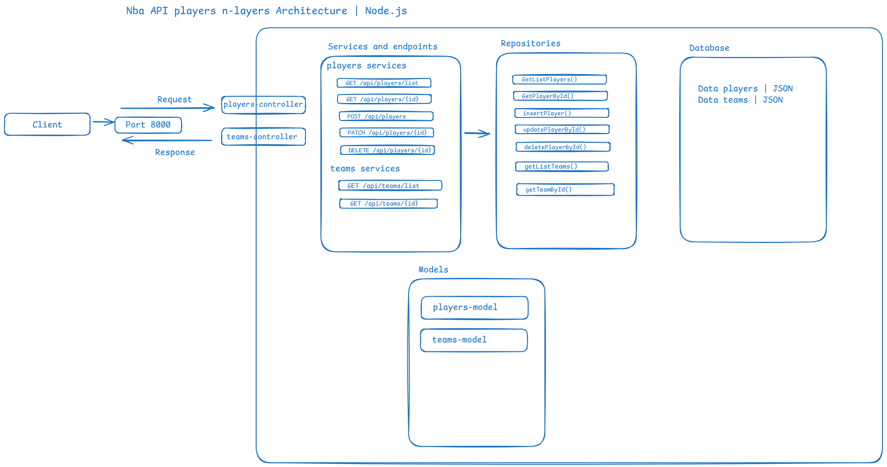

# nba-api-players
Uma api para você que gosta de basquete e quer uma base de dados de fácil acesso para o seu projeto front-end ou melhorar a própria.

### Tecnologias usadas: 


### Construção do projeto

#### Desenho da arquitetura


- **Definição dos controllers**
- **Definação das services**
- **Definição do repositories functions**
- **Definição dos models**


#### Definição dos scripts

```ts
"scripts": {
    "start:dev": "tsx --env-file=.env src/server.ts",
    "start:watch": "tsx watch --env-file=.env src/server.ts",
    "dist": "tsup src",
    "start:dist": "npm run dist && node dist/src/server.js" 
  },
```

#### Criando o arquivo server e o app
```ts
import express, { json } from "express";

function createApp(){
    const app = express();

    app.use(json());
    
    return app;

}

export default createApp;
```

```ts
import createApp from "./app";

const server = createApp()

server.listen(process.env.PORT,()=>{
    console.log('Server is Activated')
})
```

#### Implementação do services, routes e controller

```ts
import { Router } from "express";
import { getPlayer } from "../controllers/player-controllers";

const playRoutes= Router();

playRoutes.get('/players', getPlayer)

export default playRoutes;
```

```ts
import { Request, Response } from "express"

export const getPlayer = (req: Request, res: Response)=>{
    res.status(200).json({player:'lebron'});
}
```

```ts
export const getPlayerService = async ()=>{
    return {player: 'Michael Jordan'}
}
```